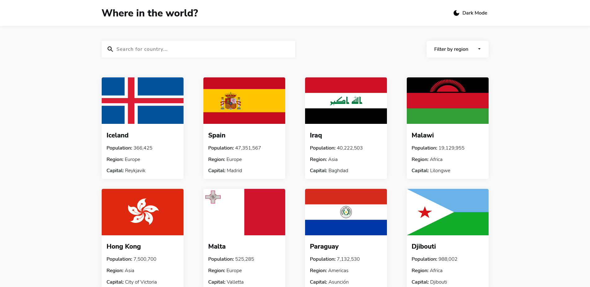

# Frontend Mentor - REST Countries API with color theme switcher

This is a solution to the [REST Countries API with color theme switcher Designe on Frontend Mentor](https://www.frontendmentor.io/challenges/rest-countries-api-with-color-theme-switcher-5cacc469fec04111f7b848ca). Frontend Mentor challenges help you improve your coding skills by building realistic projects. 

## Table of contents

- [Overview](#overview)
  - [Screenshot](#screenshot)
  - [Links](#links)
- [My process](#my-process)
  - [Built with](#built-with)
- [Author](#author)
- [Acknowledgments](#acknowledgments)
- [Installation](#installation)

## Overview


Users should be able to:

- See all countries from the API on the homepage
- Search for a country using an `input` field
- Filter countries by region
- Click on a country to see more detailed information on a separate page
- Click through to the border countries on the detail page
- Toggle the color scheme between light and dark mode

### Screenshot



### Links

- Solution URL: [https://github.com/anas-cd/rest_api/tree/dev/rest_api](https://github.com/anas-cd/rest_api/tree/dev/rest_api)
- Live Site URL: [https://rest-countries-api.onrender.com/](https://rest-countries-api.onrender.com/)

## My process

### Built with

- Semantic HTML5 markup
- CSS custom properties
- Flexbox
- Vue-cli
- Vue composition API
- Vue's suspense
- Vue router
- Vuex
- Vue transitions
- [SCSS](https://sass-lang.com/) - CSS preprocessor.
- [nprogress](https://www.npmjs.com/package/nprogress) - Slim progress bars for Ajax'y applications.
- [axios](https://axios-http.com/docs/intro) - Promise based HTTP client for the browser and node.js
- [Vue.js](https://vuejs.org/) - Front-end framework
- [Gsap](https://greensock.com/gsap/) - JavaScript animation tool
- [Bootstrap](https://getbootstrap.com/) - Frontend toolkit

## Author

- Website - [dev.anasali.info](https://dev.anasali.info/)
- Frontend Mentor - [@anas-cd](https://www.frontendmentor.io/profile/anas-cd)

## Acknowledgments

collaborators: 
[George Mushore](https://github.com/tenderking)

# installation 
navigate to rest_api folder then:  

## Setup
```
npm install
```

### Compiles and hot-reloads for development
```
npm run serve
```

### Compiles and minifies for production
```
npm run build
```

### Lints and fixes files
```
npm run lint
```

### Customize configuration
See [Configuration Reference](https://cli.vuejs.org/config/).
